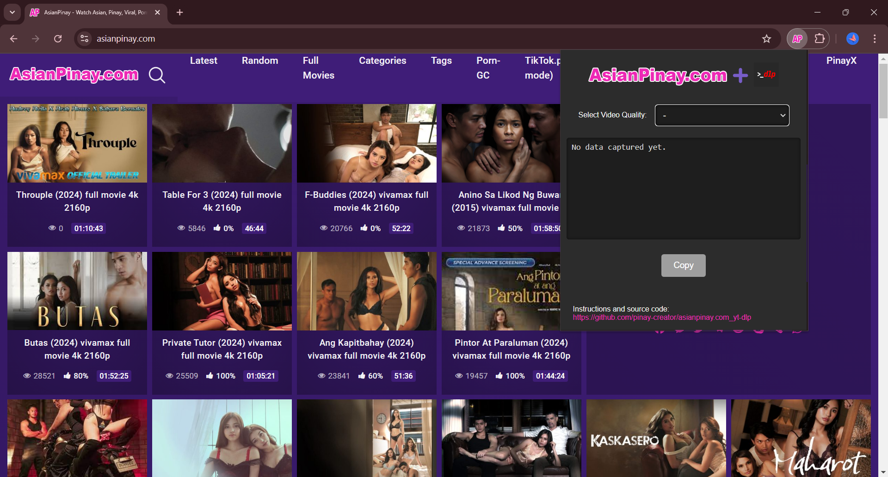
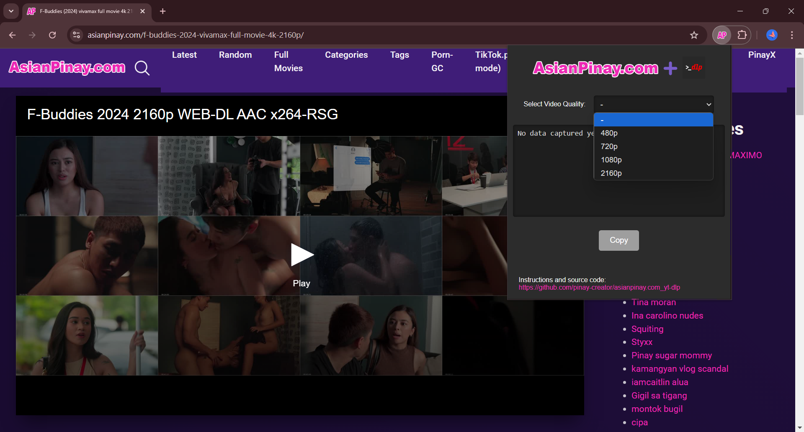
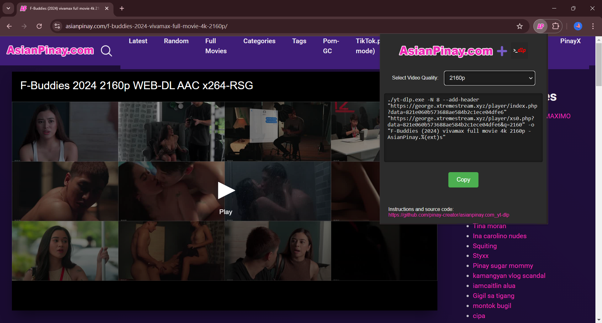
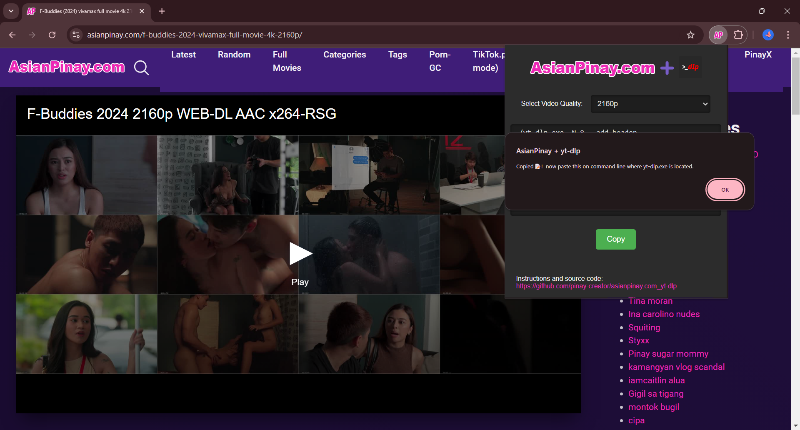
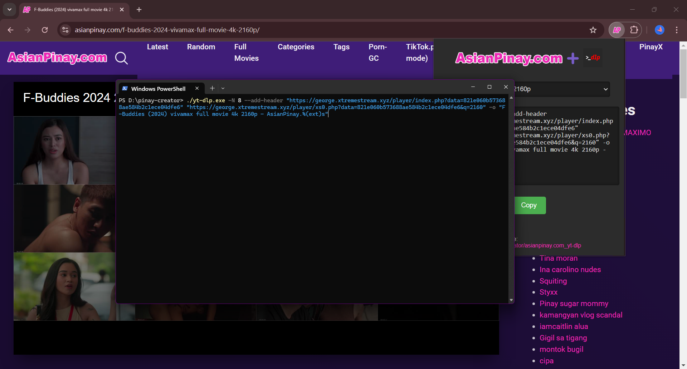
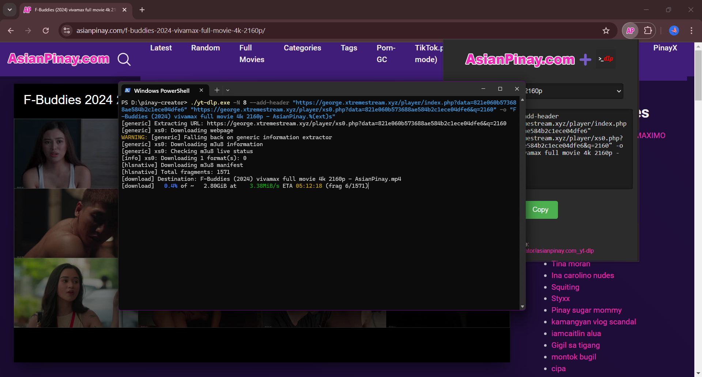
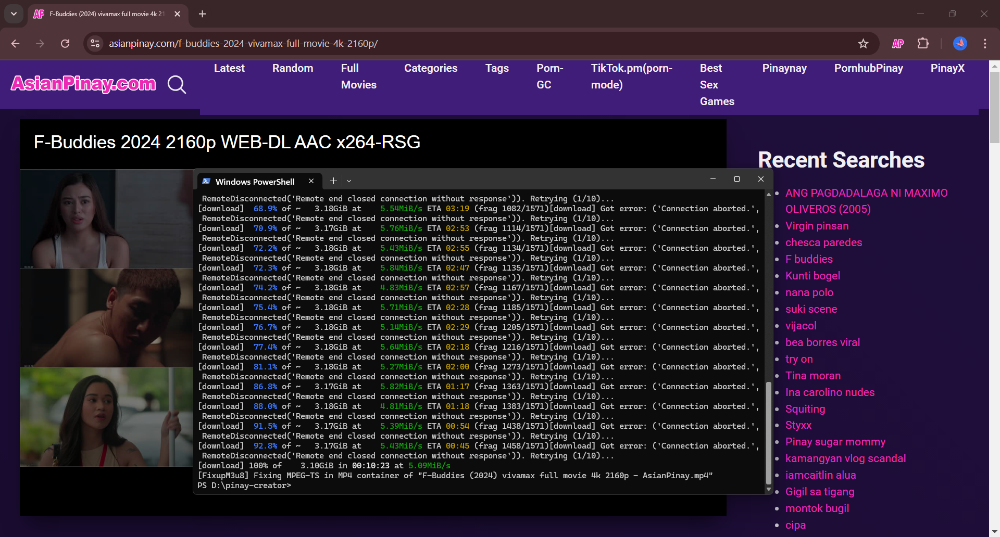
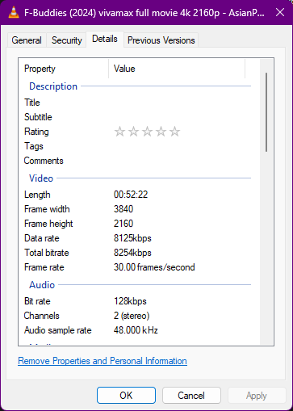

# Chrome Extension: AsianPinay Download Link Generator via yt-dlp (asianpinay.com, asianpinay.to)

This guide provides step-by-step instructions on how to install and load the Chrome extension from this repository locally on your Chrome browser.

## Prerequisites

- Google Chrome browser installed on your system.
- The extension files downloaded or cloned from this repository.

## Step 1: Download or Clone the Repository

1. Download the repository as a ZIP file or clone it using Git.
   - To download: Click on the green `Code` button at the top of this repository page, then click `Download ZIP`.
   - To clone using Git:
     ```bash
     git clone https://github.com/pinay-creator/asianpinay.com-download.git
     ```
2. If you downloaded the ZIP file, unzip it.

## Step 2: Load the Extension

1. Open Google Chrome.
2. Type `chrome://extensions/` in the address bar and hit Enter.
3. Enable "Developer mode" by toggling the switch in the top right corner.
4. Click on the `Load unpacked` button.
5. In the file dialog, navigate to the directory where you downloaded or cloned the repository.
6. Select the folder containing the extension's files (this should be the folder with the `manifest.json` file).
7. Click `Select Folder` or `Open`.

## Step 3: Verify the Extension is Loaded

Once the extension is loaded, you should see it listed on the `chrome://extensions/` page. It should also appear in your Chrome browser's extension toolbar.

## Step 4: Download Video File

To download the video file, you need to download [yt-dlp](https://github.com/yt-dlp/yt-dlp).

1. Download the latest release executable file (.exe) from the [yt-dlp release page](https://github.com/yt-dlp/yt-dlp/releases/latest) (*last tested on release version: 2024.08.06*).
2. Navigate to the folder where `yt-dlp.exe` is located, right-click on the folder, and choose "Open in Terminal".
3. Copy the link generated by the extension and paste it into the command prompt.
4. Wait for the download to complete.
5. Enjoy your video!

## Sample UI

Below is a preview of the UI for the Chrome extension:

<table border="0">
   <tr>
      <td><h3>Screenshot 1 - Initial Page</h3></td>
      <td><h3>Screenshot 2 - Video Quality Selection (available for that video)</h3></td>
   </tr>
   <tr>
      <td></td>
      <td></td>
   </tr>
   <tr>
      <td><h3>Screenshot 3 - Selected Video Quality</h3></td>
      <td><h3>Screenshot 4 - Clicked Copy</h3></td>
   </tr>
   <tr>
      <td></td>
      <td></td>
   </tr>
   <tr>
      <td><h3>Screenshot 5 - Pasted to command line (powershell)</h3></td>
      <td><h3>Screenshot 6 - Started downloading</h3></td>
   </tr>
   <tr>
      <td></td>
      <td></td>
   </tr>
   <tr>
      <td><h3>Screenshot 5 - Finished Downloading</h3></td>
      <td><h3>Screenshot 6 - Sample downloaded video property</h3></td>
   </tr>
   <tr>
      <td></td>
      <td></td>
   </tr>
</table>

*The above screenshots showcases the user interface of the extension, designed for ease of use and a clean visual experience. The "Copy" button allows you to quickly copy the generated link for downloading videos using yt-dlp.*

## Additional Information

- To disable or remove the extension, go to `chrome://extensions/` and use the toggles or remove button next to the extension.

## Troubleshooting

If you encounter any issues while loading the extension, ensure that:
- The Chrome browser is up to date.
- Developer mode is enabled.
- The downloaded repository ZIP file is the latest version and not corrupted.

For further assistance, feel free to open an issue in this repository.

---

*This extension is intended for use only on specific domains as specified in the extension's code.*
